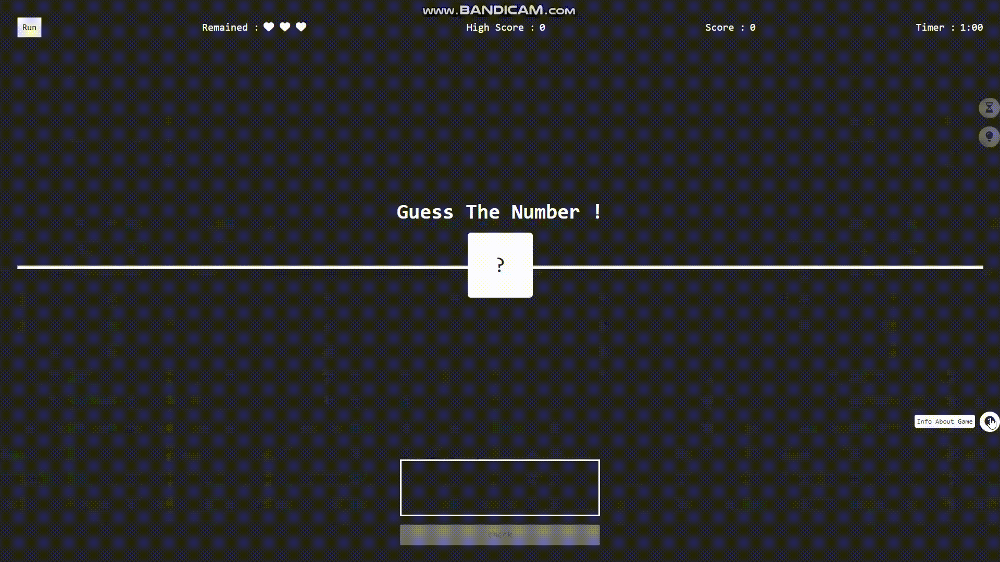

# Number Guess Game

Hello everyone. Thanks to the course I took on Udemig, I added a new one to my projects. Here is a Number Game created with html, css and javascript.

---

 <h3>Game Info</h3>
          <ul class="game-info-content">
            <li>This game is a game of the <strong> guess number</strong>.</li>
            <li>
              You have <strong>3 lives</strong> and <strong>1 minute </strong>of
              time.
            </li>
            <li>
              Try to guess the number without guessing wrong and taking into
              account the time, <strong> collect the scores!</strong>
            </li>
            <li>
              The number to be guessed is <strong>between 1 and 10. </strong>
            </li>
            <li>
              The game ends when you run out of lives or when time runs out.
            </li>
            <li>
              <strong> Click </strong> the
              <button>Run</button>
              on the top left to start the game.
            </li>
          </ul>
           <h3>Bonus Info</h3>
          <ul class="game-bonus-content">
            <li>
              You are entitled to <strong>2 bonuses </strong> in the game. You
              can choose bonuses <strong> only 1 time</strong>.
            </li>

            <li>
              <strong>Time Bonus </strong>: Stops time in the game for
              <strong>10 seconds</strong>.
            </li>
            <li>
              <strong>Game Info </strong>: Gives you
              <strong>hints about the number </strong>, so you can make more
              accurate predictions.
            </li>
          </ul>

# Short Gif

